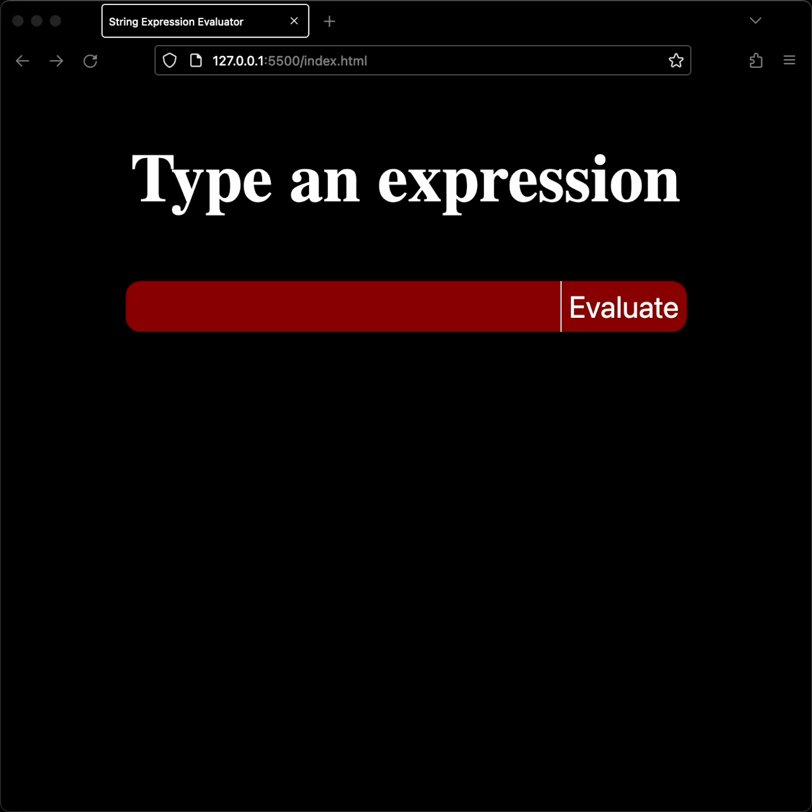
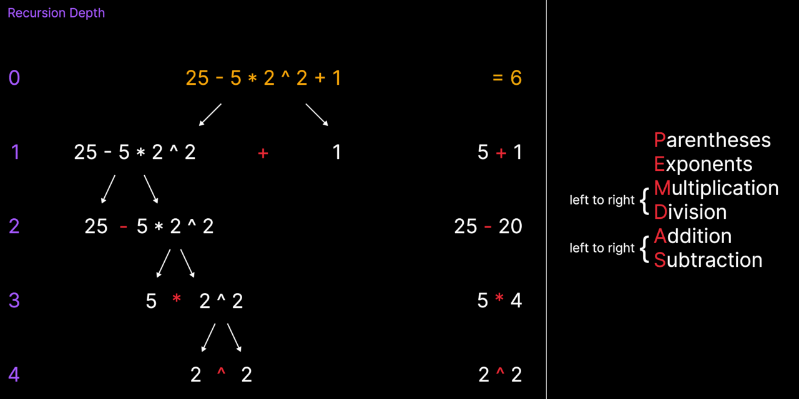

# String Expression Evaluator
 Evaluates string expressions using an input textbox
 
  

## General Information
- Full PEMDAS support
- Checks validity of expression and returns useful error messages
- Has test cases to ensure testing function works properly

## Video Tutorials
Expression evaluator tutorial: [click here](https://www.youtube.com/watch?v=pNXY8alQqCs)

Testing and optimization tutorial: [click here](https://www.youtube.com/watch?v=ViiG5ZZIccQ)

## Images

## Contact
Created by [@valle572](https://itsvalle.com) - feel free to contact me :)
